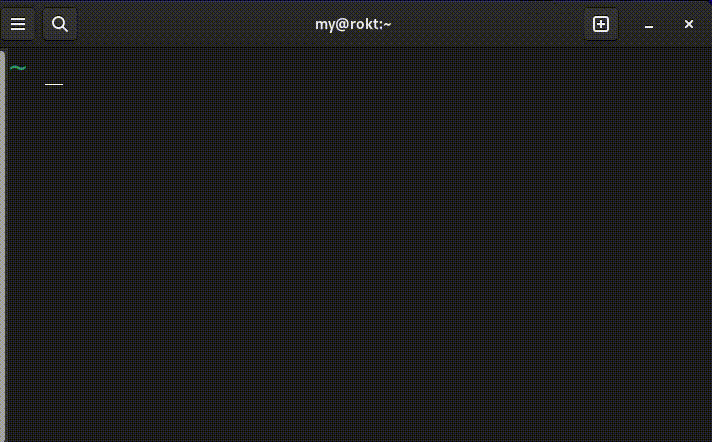

## dir100 is a CLI that generates empty text files.

### Demo:

### Goal:

This tool is meant to serve as a practice for the Rust language.

### How to use?

Download the binary from the releases page [here]()

> Note #1: the binary only worx on Linux at the moment

### Examples:

`dir100 -f 1` should generate a fake empty .txt file inside `dir_100` directory

`dir100 -f 3 -d 10` should create 10 directories, including 3 empty .txt files each

`faker -h` show help

> Note #2: all generated files  & directories are created within a `dir_100` directory

Idea and execution by Muhammad Yasser @ the 2024.
